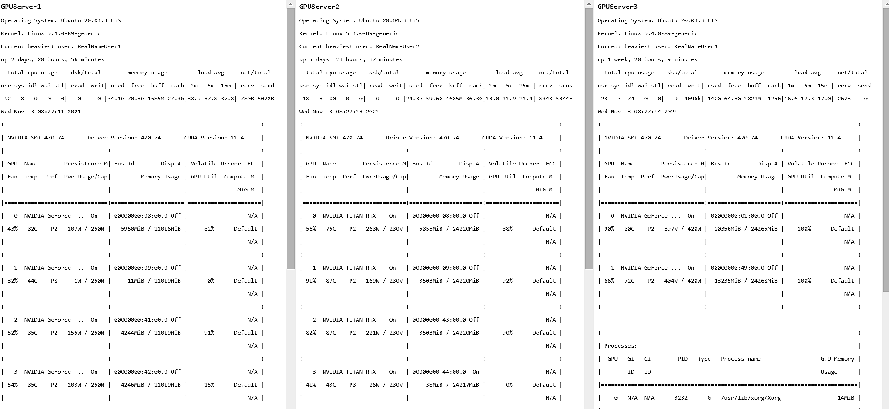

# NvidiaGPUServerWebMonitor
Monitor GPU, CPU, RAM and storage load for your Deep Learning server with standard Linux tools from a comprehensive web interface.
To get started: 
- Set up a python virtual environment, see python script for needed packages. 
- Edit python script with your ip adressess and credentials
- See bash file for starting python script within the python virtual environment. 
- Enter your web adress in a browser and enjoy the periodic updates :) 

